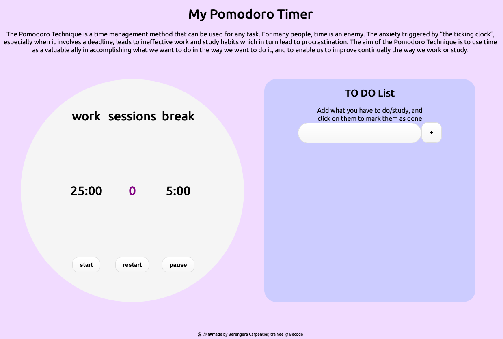

# 🌱 Leaving The Hill - Front End Projects
made by Bérengère Carpentier, trainee @ 🏢 BeCode.

## What is it about ?
We're ending the Hills portion of our training, and before we start learning about the back-end, we were given 4 challenges to re-enforce our front-end skills.

# Challenge 4 - The Pomodoro Timer
A webpage where you can set a [Pomodoro timer](https://en.wikipedia.org/wiki/Pomodoro_Technique). The webpage should only display a **< button >** named "Start", when clicked, it should start a sequence.

src ➡️ [instructions](https://github.com/becodeorg/bxl-hopper-1-25/tree/master/The%20Hill/projects/99.leaving_the_hills)

link to project ➡️ click HERE  

# Preview

